background-image: url(https://w.wallhaven.cc/full/3z/wallhaven-3zzd8y.jpg)
background-size: cover
class: center, top

<span style="color:white; font-size: 60px; font-weight: bold;"> De Estatístico p/ Cientista de Dados  </span>

```{r, echo = FALSE}
source('util.R')
```

---
# Agenda 

+ Gabriel Sartori klostermann
+ Experiência Equipe de Ciência de Dados 
+ Visão de Negócio
+ Arcabouço de Tecnologia
+ Viés do Estatístico

---
# Gabriel Sartori Klostermamn

+ Natural de Joinville

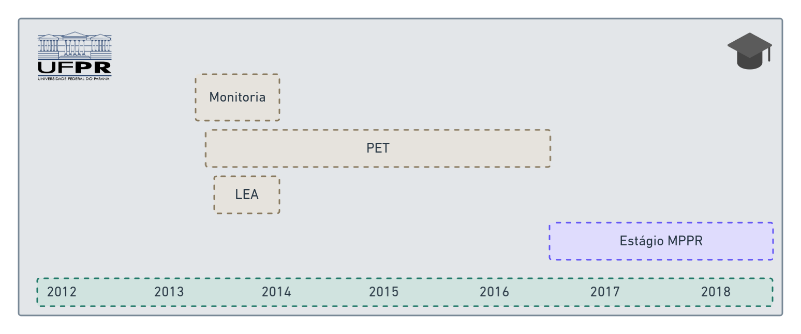


<!-- Transformar em Gráfico da linha de Tempo -->

---
# MAPI / Isket 

.pull-left[


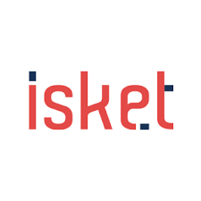
]

--
.pull-right[

+ Quando entrei na empresa não tinha nome , cnpj

+ Havia 5 sócio, 2 estagiários e 1 cientista de dados (EU)

+ Empresa já iniciando com uma área de dados

+ As análises de dados tinha o principal grupo: **Clientes Externos**

+ Setembro/2018 - Dezembro/2019

]

---
class: middle, center
background-image: url(img/crawling.png)
background-size: cover

---
class: middle, center
background-image: url(img/ifood.png)
background-size: cover

---
class: middle, center
background-image: url(img/airview.jpg)
background-size: cover

---
# James Delivery

.pull-left[

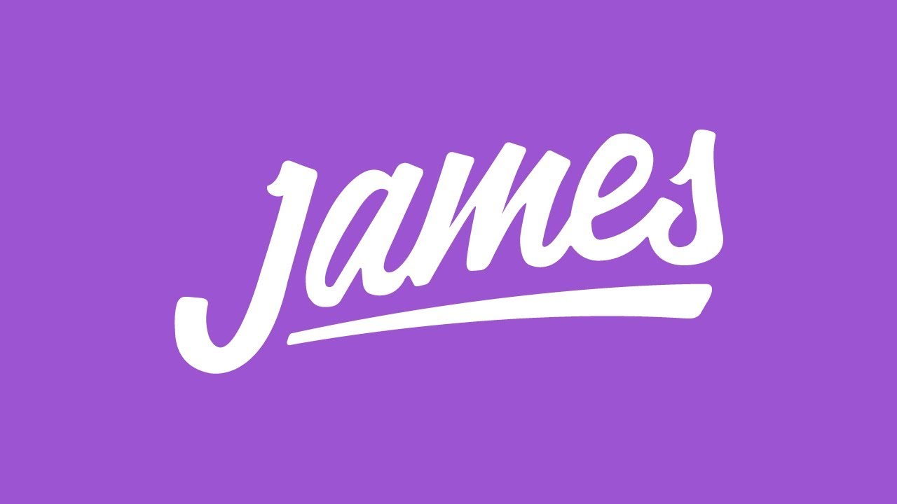

]

.pull-right[

+ Empresa desde 2015, comprada pelo GPA em 2018

+ Final de 2019, empresa iniciando a área de dados 

+ Apenas 1 Engenheiro, 1 Cientista e 5 analistas de Dados, 1 Diretor de Dados  

+ As análises de dados tinha o principal grupo: **Clientes Internos**

+ Tempo de Permanência  Março/2020 - Maio/2021

]

---
class: Top, Left
background-image: url(img/james_3_lado.png)
background-size: cover

<!-- #* Diagrama de Venn -->

---
class: middle, center
background-color:  #E0F2F1

---
class: middle, center
background-color: #E0F2F1

# Equipe de Dados

---
# Hierarquia


---
# Rituais

+ Daily 

+ Reunião semanal de Ciencia de Dados 

+ Review (A cada 15 Dias)

+ Growth (Métricas da Empresa)

+ All hands (Visão geral da Empresa)

+ [SCRUM][SCRUM]

---
# Posicionamento de Ciência de Dados 

.pull-left[
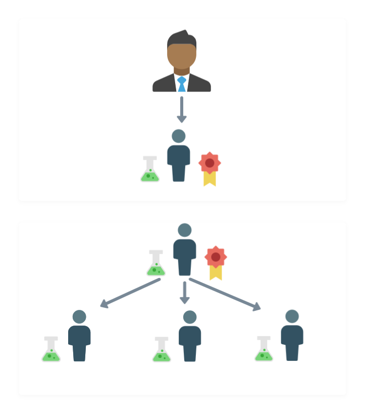
]

.pull-right[
+ Projetos Trimestrais 

+ Apenas o líder desenvolvia visão de negócio

+ Não havia cientista de dados fixos por área

]

---
# Posicionamento de Ciência de Dados 

.pull-left[
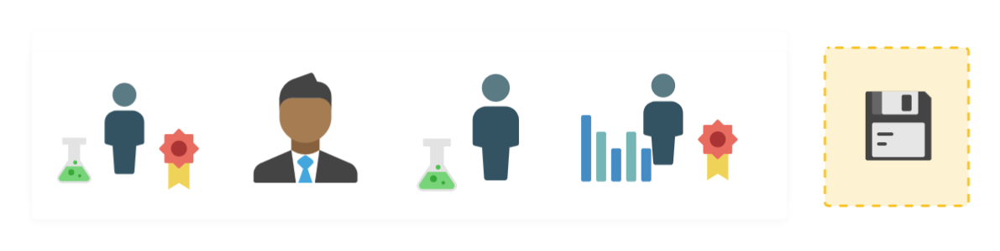
]

.pull-right[
+ Ciclo de 6 semanas por projeto

+ Participação das reuniões de negócios Semanal (FUP)  

+ Oportunidade de apresentar os resultados parciais 

+ Fixar cientista de dados por área

]

---
# Posicionamento de Ciência de Dados 

.pull-left[
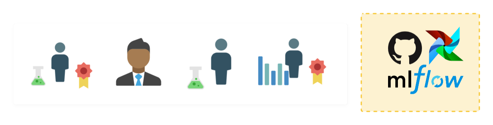
]

.pull-right[
+ Todo projeto no Github 

+ Acompanhamento e definição de rotinas no Airflow

+ Acompanhamento, registro e predição em batch do Modelo pelo mlFlow

+ Teste e mudanças no aplicativo 

]

---
# Posicionamento de Analista de Dados

.pull-left[
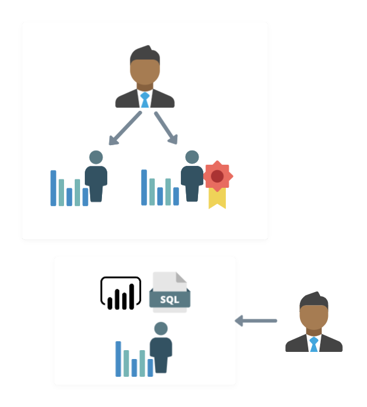
]

.pull-right[
+ Ciclo Trimestral 

+ Criação das Demandas: Analista, Analista Leader e Área de Negócio Juntos.

+ Excesso de demanda não planejada

]

---
# Posicionamento de Analista de Dados


.pull-left[
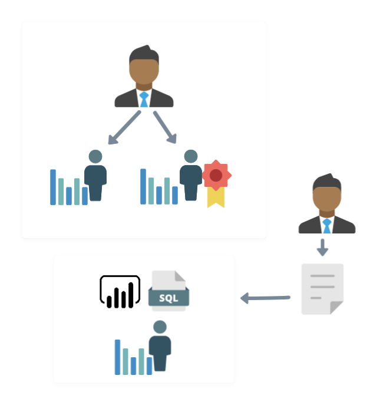
]

.pull-right[
+ Criado um Formulário para registro das atividades extras

+ Havia mais atividades Extras do que planejadas

+ Dashboards eram criados e apenas o analista usava

]

---
# Posicionamento de Analista de Dados


.pull-left[
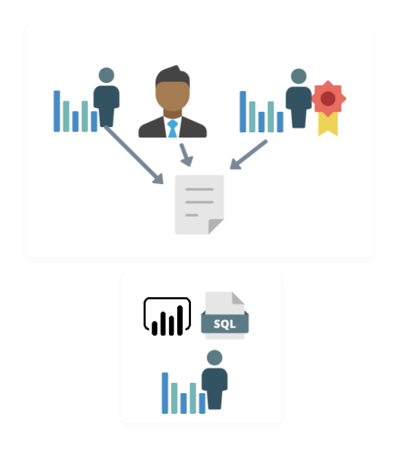
]

.pull-right[
+ Ciclo de 2 semanas

+ Cada área tinha o próprio backlog

+ Inicio do projeto de Democratização de Dados

  + Conhecimento de SQL

  + Conhecimento de Estatística Básica

  + Conhecimento das Ferramentas do Time de Dados 

]

---
# Camadas de Análises de Dados

```{r, fig.width=10, echo = FALSE}
molde_analise()
```

---
# Aprendizados do processo


+ A equipe de negócio queria todos os dados, para realizar estudos próprios

+ As demandas do time de Análise eram muitas vezes Consultas ao Banco

+ A hipótese que ele quer avaliar não tem o dado

+ Métricas para confirmar o "bom" rendimento da equipes

+ Diferenças estatísticas eram diferenças matemáticas (Sensível demais a mudanças)

+ O demandante não tinha a visão que a hipótese poderia ser escalável

---
# Melhorias no Processo

+ Projetos de iniciativa própria de dados

+ Mensurar o impacto da área de dado

  + Quantidade de Horas ganha com automatização

  + Qual influencia do novo modelo nas métricas de negócio?

  + Hipótetes Validadas 

+ Velocidade na criação das apresentações

 
---
# Agile Data Science 

+ Ciência de Dados é mais pesquisa do que Desenvolvimento

--
+ Canvas de [Machine Learning][CANVAS_ML]

+ Modelo de equipe [Creditas]

+ Modelo de equipe [Olist]

+ Modelo de equipe [Nubank]

---
class: middle, center
background-color:  #E0F2F1

# Visão de Negócio

---
class: top, left 
background-image: url(img/diagrama_venn.png)
background-size: cover

# Cientista de Dados 

---
class: middle, center
background-image: url(img/especialidade.png)
background-size: cover

---
class: middle, center
background-image: url(img/feeder.png)
background-size: cover

---
class: Top, left
background-image: url(img/loft_ciencia_de_dados.png)
background-size: cover

## [LOFT Ecossistema][LOFT_PRODUTOS_DS]

<br><br><br><br>

## [LOFT Precificação][LOFT_REGRESSAO_INTERVALAR]

---
class: Top, left
background-image: url(img/5ANDAR.jpg)
background-size: cover

## [ESTUDO DE PRECIFICACAO][5ANDAR_PRECIFICACAO]

---
# Links Úteis Mercado Imobiliário
 
+ [HUB_IMOBILIARIO][HUB_IMOBILIARIO]
+ [5ANDAR][5ANDAR]
+ [LOFT][LOFT]

---
class: Top, left
background-image: url(img/rappi_logo.png)
background-size: contain

## [MAPA][RAPPI_MAPA]

---
class: Top, left
background-image: url(img/delivery_much.png)
background-size: contain

## [Consumo Online][DELIVERY_MUCH]

---
# LInks Úteis 

+ [IFOOD][IFOOD]
+ [RAPPI][RAPPI]
+ [AIQFOME][AIQFOME]
+ [DELIVERY_MUCH][DELIVERY_MUCH]

<!-- James não faz publicidade no Site--> 

---
class: middle, center
background-color:  #E0F2F1

# Visão de Negócio - Empresa

---
class: Top, left
background-image: url(img/brazil_journal.png)
background-size: cover

## [BRAZIL_JOURNAL][BRAZIL_JOURNAL]

## [PGB_2021][PESQUISA_GAMER]

## [150_mil_modelos][150_mil_modelos]

## [Cansei de Ser Gato][PETZ]

---
class: middle, center
background-color:  #E0F2F1

# Tecnologia

---
# Banco de Dados 

.pull-left[


<!--  -->
]

--
.pull-right[

+ Tempo de aprendizagem da linguagem da consulta 
{{content}}
] 

--
+ Quanto tempo demoro para extrair os dados?

+ Quais pré-processamento realizo na extração?
{{content}}

--
+ Migrando tudo para DataLake
{{content}}

---
# "Banco de Dados" em Estatística

+ Arquivo txt, csv, rds

+ Arquivo único 

+ Dados Tabulares 

+ Menos de 10.000 linhas

--
+ Vício em DataFrame 

---
# Script de Análise de Dados  

.pull-left[
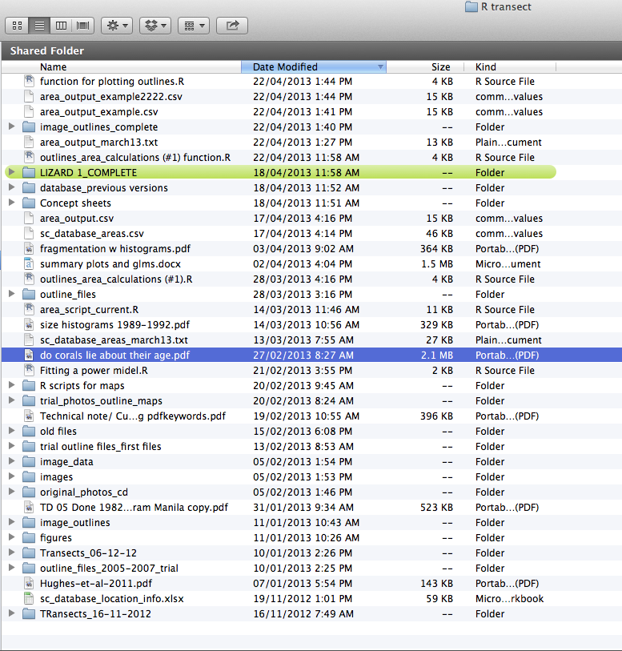
]

--

.pull-right[

- nomes das variáveis sem padrao...(df_1, x, t, c, z10)

- Não tem um arquivo próprio de função

- Mais de 1000 linhas de código

- Sem identação em function, for, if, while 
{{content}}
]

--

- [Guia de estilo][STYLE_GUIDE_R] 
{{content}} 


---
# Pipeline de Dados 

.pull-left[

+ Mundo TidyVerse


]

--
.pull-right[
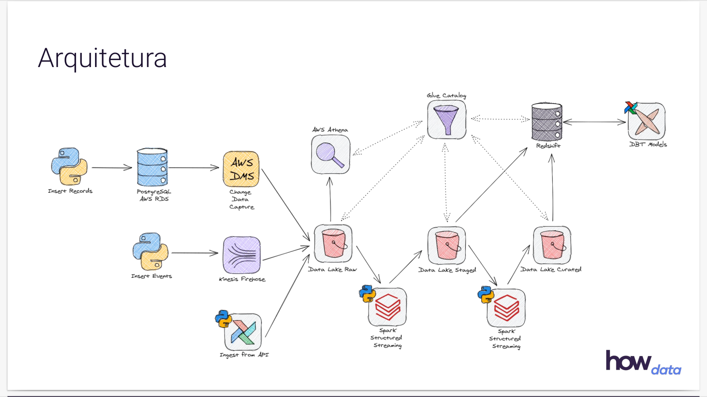
]  


---
# Integração Contínua e Desenvolvimento Contínuo

--
.pull-left[

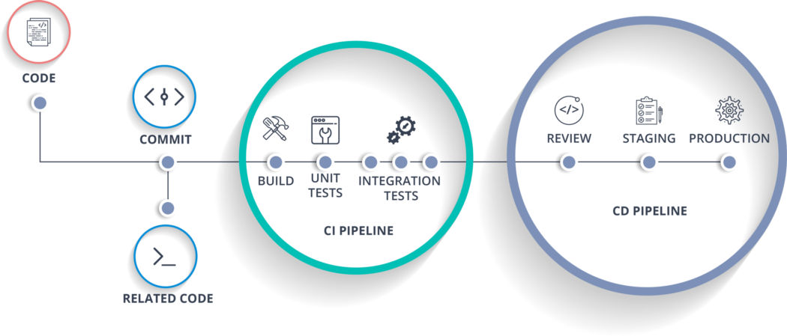

]

-- 
.pull-right[

+ .Rmd, .R como faço para passar a diante? 
{{content}}
]

--

+ [GITHUB][GITHUB]: Versionamento de Código

+ [GITHUB_ACTIONS][GITHUB_ACTIONS]: Automatizar as ações do github

+ [Docker][Docker]: Congelar todo sua aplicacao em uma imagem (Seta sistema operacional, versao do R, e executa o teu script)

+ [Airflow][AIRFLOW]: Agendador Acíclico de tarefa, principalmente ETL

+ [Mlflow][MLFLOW]: Gerenciar modelos, criar experimentos, salvar o modelo para predição em batch

+ [Plumber][PLUMBER]:Disponibilizar os resultados em API

+ [Shiny Proxy][SHINY PROXY]

+ [AWS][AWS]: Alugar servidor, constuir pipeline de dados, executar scripts


---

# Pratique com Scraping

+ Arquivos Json 

+ Manipular Listas

+ Dados que Atualizam

+ Interargir com [API][API]

--

+ [SCRAPY][SCRAPY]

+ [HTTR][HTTR]


# Viés do Estatístico

---
class: Left, middle
background-image: url(img/the_office.jpg)
background-size: cover

<span style="color:white; font-size: 50px; font-weight: bold;"> "Queremos KPI"  </span>
<br><br>
<span style="color:white; font-size: 50px; font-weight: bold;">  "Precisamos Entregar Valor para o Cliente" </span>

---
# Cegueira do Pressuposto 

+ O que eu preciso fazer para tornar o modelo válido?

```{r, echo = FALSE, warning = FALSE, message = FALSE, fig.width=8}

model_sem <- get_modelo_sem_pressuposto()
performance::check_model(model_sem)
```

---
# O resultado termina no Resumo do Modelo 

```{r}
model_sem |> summary()
```

---
# Estatística Descritiva direcionada a Modelagem 

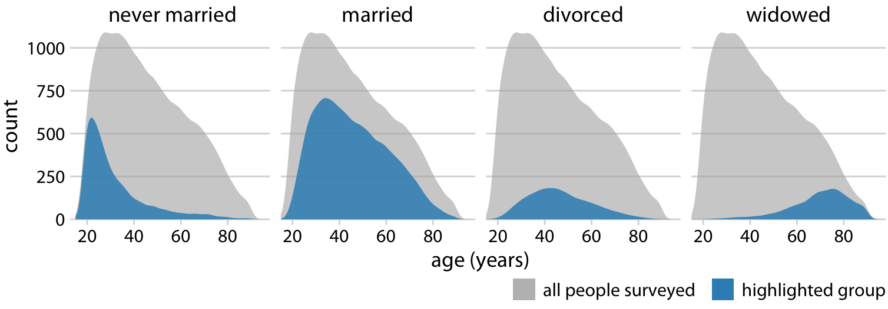

+ Quem tem distribuição normal?, Qual a assimetria, curtose da distribuição?

---
# Resolve problemas já formulados!  

+ "Dado que foi capturado o dado "x, y, z" e que queira realizar um estudo de qual variável afeta tal variável.s "

+ "Dado um estudo clínico em que os pacientes foram submetidos aos seguintes procedimentos, qual a taxa de reicidencia da doença"

--
+ Escravo do Método

---
# Matrix Curricular 

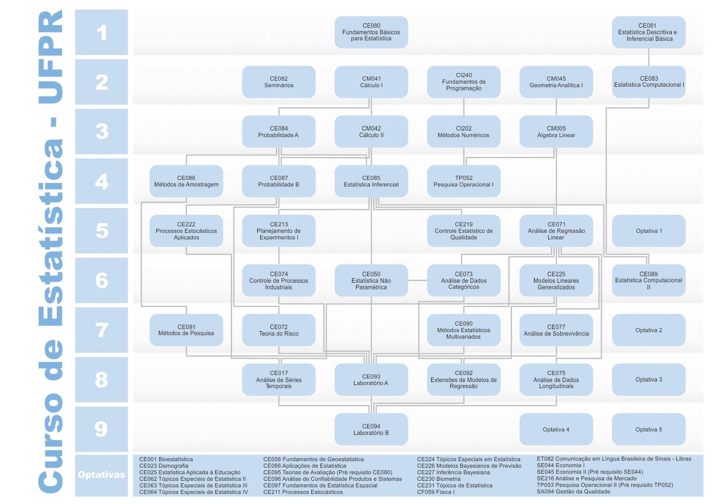

+ Incluir Matéria de Empreendedorismo  (6º Período)

+ Incluir Matéria de Rotinas Computacionais (5° Rotinas Computacionais)


<!-- Links  -->
<!-- Ramo Imobiliário  -->
[LOFT_PRODUTOS_DS]: https://medium.com/loftbr/data-decision-science-loft-nosso-ecossistema-de-algoritmos-919ab9d33505
[LOFT_REGRESSAO_INTERVALAR]: https://medium.com/loftbr/indo-al%C3%A9m-de-previs%C3%B5es-pontuais-de-pre%C3%A7os-de-im%C3%B3veis-9cb4d5183363
[5ANDAR_PRECIFICACAO]: http://hubimobiliario.com/precificar-o-imovel-errado-compromete-ate-22-da-renda-anual-do-proprietario/
[HUB_IMOBILIARIO]: http://hubimobiliario.com/
[5ANDAR]: https://meulugar.quintoandar.com.br/
[LOFT]: https://medium.com/loftbr

<!-- Ramo Alimentício  -->
[RAPPI_MAPA]: https://blogbra.soyrappi.com/saiba-os-melhores-lugares-para-aceitar-pedidos-de-moto-em-sao-paulo/
[DELIVERY_MUCH]: https://blog.deliverymuch.com.br/numeros-do-delivery-online-no-brasil/

[IFOOD]: https://entregador.ifood.com.br/ 
[RAPPI]: https://blogbra.soyrappi.com/ 
[AIQFOME]: https://frigideira.aiqfome.com/
[DELIVERY_MUCH]: https://blog.deliverymuch.com.br/

<!-- Inovação --> 
[BRAZIL_JOURNAL]:https://braziljournal.com/
[PESQUISA_GAMER]: https://www.pesquisagamebrasil.com.br/pt/ebooks/
[150_mil_modelos]: https://braziljournal.com/como-prever-as-vendas-o-algoritmo-da-4intelligence-testa-milhoes-de-modelos-por-dia 
[PETZ]: [https://braziljournal.com/petz-compra-cansei-de-ser-gato-em-seu-primeiro-ma]

<!-- Listas -->
[PURRR]: https://www.datacamp.com/courses/foundations-of-functional-programming-with-purrr

<!-- Crawling -->
[SCRAPY]: https://scrapy.org/ 
[HTTR]: https://cran.r-project.org/web/packages/httr/vignettes/api-packages.html
[API]: https://github.com/public-apis/public-apis

<!-- Formatação de Código -->
[PEP8]: https://www.python.org/dev/peps/pep-0008/
[STYLE_GUIDE_R]: http://adv-r.had.co.nz/Style.html

<!-- Data Viz-->
[DATAVIZ]: https://clauswilke.com/dataviz/

<!-- Ferramentas -->
[AIRFLOW]: https://airflow.apache.org/
[MLFLOW]: https://mlflow.org/
[AWS]: https://aws.amazon.com/pt/free/?all-free-tier.sort-by=item.additionalFields.SortRank&all-free-tier.sort-order=asc&awsf.Free%20Tier%20Types=*all&awsf.Free%20Tier%20Categories=categories%23compute&trk=ps_a134p000006gXvEAAU&trkCampaign=acq_paid_search_brand&sc_channel=PS&sc_campaign=acquisition_BR&sc_publisher=Google&sc_category=Cloud%20Computing&sc_country=BR&sc_geo=LATAM&sc_outcome=acq&sc_detail=aws%20cloud&sc_content=Cloud%20Hosting_e&sc_matchtype=e&sc_segment=490489331981&sc_medium=ACQ-P|PS-GO|Brand|Desktop|SU|Cloud%20Computing|Solution|BR|EN|Text&s_kwcid=AL!4422!3!490489331981!e!!g!!aws%20cloud&ef_id=CjwKCAjwi9-HBhACEiwAPzUhHFxe70bIbjxA4L_YUzIKT5JJoRi_logdXW_brMUIbf0DQc7SYONXDBoCRGsQAvD_BwE:G:s&s_kwcid=AL!4422!3!490489331981!e!!g!!aws%20cloud
[DOCKER]: https://docker-curriculum.com/#introduction
[SHINY PROXY]: https://www.openanalytics.eu/tags/shinyproxy/
[GITHUB]: https://guides.github.com/activities/hello-world/
[GITHUB_ACTIONS]: https://github.com/features/actions
[PLUMBER]: https://www.rplumber.io/

<!-- Time de Ciência de Dados --> 
[SCRUM]: https://scrumguides.org/docs/scrumguide/v1/Scrum-Guide-Portuguese-BR.pdf
[CANVAS_ML]: https://www.ownml.co/machine-learning-canvas

[Creditas]: https://medium.com/creditas-tech/como-dar-mais-agilidade-nas-entregas-do-time-de-data-science-9003a1e6c898
[Olist]: https://medium.com/@andresionek91/como-estruturar-uma-equipe-de-an%C3%A1lise-de-dados-em-uma-startup-parte-1-509a9c65cfe2
[NUBANK]: https://www.youtube.com/watch?v=4PvqfLy3_TA
